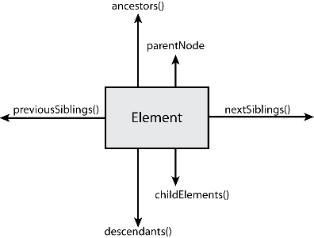

###### Fast Campus

## [JavaScript & jQuery 정복 CAMP](http://www.fastcampus.co.kr/dev_camp_jst/)

### JavaScript 시작하기 & 핵심 정복기

- 문서객체모델(DOM) : 탐색
- 선택/탐색과 관련한 헬퍼 함수 만들기
- 문서객체모델(DOM) : 조작
- 조작과 관련한 헬퍼 함수 만들기

-

### 지난 수업에서 공부한 내용 복습!

[JJ_CAMP__TEST 2016/07/03](http://goo.gl/forms/vrh7guI8h2KSKpcD3)

-

### 문서객체모델(DOM) **탐색**

- 문서 객체 탐색
  - 부모 찾기
  - 형제 찾기
  - 자손 찾기
  - 자식 찾기

-

### 선택/탐색과 관련한 헬퍼 함수 만들기

- `idEl()`
- `tagEl()`
- `classEl()`
- `query()`
- `gueryAll()`

-

### 문서객체모델(DOM) **조작**

- 문서 객체 조작
  - 생성 [요소/텍스트]
  - 속성 가져오기/설정하기/소유확인/제거하기
  - 추가(삽입)
  - 이동
  - 복제
  - 제거

-

### 조작과 관련한 헬퍼 함수 만들기

- `createEl()`
- `getAttr()`
- `setAttr()`
- `hasAttr()`
- `attr()`
- `removeAttr()`
- `html()`
- `text()`
- `addClass()`
- `removeClass()`
- `hasClass()`
- `toggleClass()`
- `radioClass()`

-

### 기타/참고