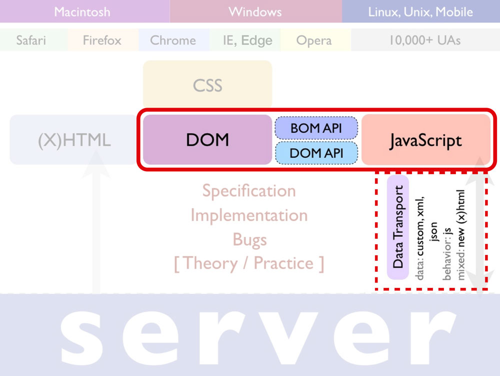
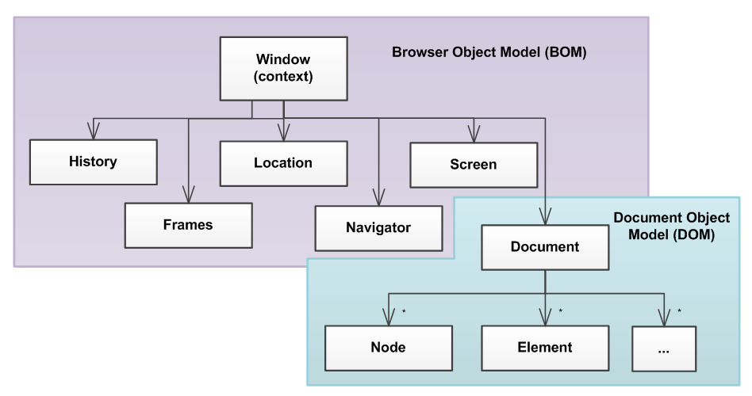
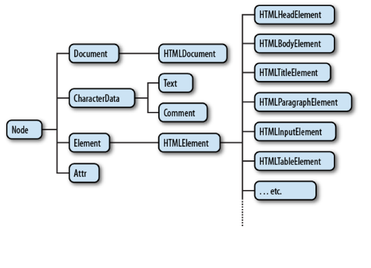

###### Fast Campus

## [JavaScript & jQuery 정복 CAMP](http://www.fastcampus.co.kr/dev_camp_jst/)

# DAY01

### JavaScript 시작하기

- 클라이언트 자바스크립트 환경
- 브라우저객체모델(BOM)
- 문서객체모델(DOM) : 선택/탐색
- 선택/탐색과 관련한 헬퍼 함수 만들기

-

### 우리가 정복해야 할 것!

-

### 클라이언트 자바스크립트

분류 | 설명
--- | ---
자바스크립트 Core | 문법 기본 문법과 구조, 데이터 타입, 조건문, 반복문, 함수, 객체, 클래스(생성자, 프로토타입) 등
자바스크립트 Core 라이브러리 | 자바스크립트에서 기본 제공되는 클래스(Number, String, Date, Math, Array, ..)
자바스크립트 DOM(Document Object Model) | 노드(Node), 스타일, 속성, 이벤트, 위치 및 크기 등을 다룰 수 있는 다양한 기능이 포함
자바스크립트 BOM(Browser Object Model) | 브라우저와 관련된 Window, Navagator, Location, History, Document, Screen 객체들이 포함

-

#### BOM(브라우저 객체 모델) / DOM(문서 객체 모델)

##### DOM이란?

브라우저 화면에 보이는 요소를 조작하기 위한 기능으로 가득 차있는 각각의 라이브러리 덩어리로 이해할 수 있다.
일반적으로 자바스크립트 DOM이나 DOM은 같은 의미로 사용. DOM에서 제공하는 일반적인 기능은 아래 이미지처럼 여러 개의 DOM 객체로 나누어져 구성된다.

-

###### [D] Document (문서)

문서 객체 모델은 문서가 없으면 동작하지 않는다. 웹에서 사용할 문서를 만들어 웹 브라우저에 출력하는 순간 DOM이 살아 움직이기 시작하며,
이것은 작성된 웹 문서가 브라우저의 해석을 통해 객체로 변경되기 때문에 가능한 것이다.

-

###### [O] Object (객체)

자바스크립트 세상에는 3 종류의 객체가 존재한다.

1. 웹 브라우저가 제공하는 클라이언트 네이티브 객체
1. 배열,수학,날짜와 같이 자바스크립트에서 이미 만들어진 코어 라이브러리 객체
1. 사용자가 정의하는 커스텀 객체

자바스크립트 초기에는 중요한 몇가지 주요 객체들이 스크립트 제작에 사용되었으며, 그 중 가장 기본적인 것이 윈도우 객체(window object)이다.
이러한 객체는 웹 브라우저 창의 속성을 말하며, 이를 브라우저 객체모델(BOM, Browser Object Model)이라고 부른다.
브라우저 객체 모델은 `window.open()` 또는 `navigator.userAgent` 같은 것을 말한다.

DOM은 웹 브라우저 창 안의 문서 내용을 다루는 문서(document) 객체가 대상이다.

- `BOM` 웹 브라우저와 관련된 객체 및 속성.
- `DOM` 웹 브라우저 창 안의 문서와 관련된 객체 및 속성.

-

###### [M] Model (모델)

DOM에서 사용하는 가장 중요한 규칙은 문서를 나뭇가지(tree)형 구조로 표시하는 것으로 이러한 구조도는 HTML에서 문서를 가장 잘 표현하는 방법이다.
`<html>`은 모든 요소의 부모(Root Element)이며 `<head>`와 `<body>`는 형제 관계를 이루고 있고 이런 식으로 부모/자식 관계를 맺어가는 것이
기본적인 **document 구조**. 이러한 형태를 **노드 트리**라 부른다.

> **Node** : 어떤 연결망에서 특정 지점과 지점을 연결하는데 표시하는것을 말하며 네트워크는 노드의 집합을 뜻함.

> 현실 세계에서 모든 것은 원자로 구성되어 있고, 원자는 세상의 노드라고 할 수 있으며 원자보다 작은 양성자나 전자 등도 노드라고 부를수 있다.
> 마찬가지로 DOM 또한 노드의 집합이며, 문서라는 나무 위에 가지나 잎 같은 노드를 갖고 있는 것과 같다.

---

### DOM API: 문서 객체 선택과 탐색

HTML Parser는 `<script>` 요소를 만나면 더 이상 일을 안하고 쉰다.
고로 `<head>` 내부에 `<script>` 요소를 사용하지 않을 것을 권장한다.

-

### 변수 정리

- 변수란?  `데이터를 저장하는 기억(Memory) 공간`
- 변수 이름 작성 규칙
  - 반드시!!! 변수를 정의할 때는 `var` 키워드를 앞에 붙여준다.
  - 숫자가 맨 앞에 오면 안된다.
  - 변수 이름 사이에 공백이 있으면 안된다.
  - `$`, `_`을 제외한 특수문자는 사용할 수 없다.
  - 모두 대문자로 작성하지 말아라. (모두 대문자는 상수(`const`)를 작성할 경우 사용)
- 변수를 선언하는 방법
  - `var 변수이름;`
- 변수에 값을 할당하는 방법
  - `var 변수이름 = 데이터 값;`
- 변수에 할당하거나 참조하는 데이터 유형
  - 아래(↓) 데이터 유형 6가지 확인

#### 자바스크립트 데이터 유형

자바스크립트에서 사용되는 데이터 유형은 다음과 같다.

###### 자바스크립트 주요 객체

- 숫자 객체(`Number`)
- 문자 객체(`String`)
- 불린 객체(`Boolean`)
- 배열 객체(`Array`)
- 함수 객체(`Function`)
- 객체(`Object`)

###### 객체가 아닌 것들

- `null`
- `undefined`

-

### 데이터 유형을 체크하는 방법

- `typeof`
- `instnaceof`
- `constructor`

※ `typeof`의 치명적 오류는 다음 시간에...

-

#### 문서 객체 선택 API

문서 객체에 접근하는 방법은 다음과 같다.

- `.getElementById()`
- `.getElementsByTagName()`
- `.getElementsByClassName()`
- `.querySelector()`
- `.querySelectorAll()`

※ `.querySelector()`/`.querySelectorAll()` IE 8+ 지원

-

### 헬퍼 함수 『선택/탐색』

다음 시간에...

-

### 자바스크립트 기초가 부족하신 분들에게 유용한 도서/강의

- [`JavaScript`, Codecademy](https://www.codecademy.com/learn/javascript)
- [자바스크립트 온라인 무료 강의, 생활코딩](http://opentutorials.org/course/743)
- [자바스크립트+jQuery 완전정복 스터디 1 기초편](http://book.naver.com/bookdb/book_detail.nhn?bid=9650891)

-

### 웹폰트 로컬스토리지 저장 방법

- [웹 폰트를 로컬 스토리지에 저장하는 기법 - 캐시 안정성 증가, 글꼴 깜빡임 현상 제거](http://mytory.net/2016/06/15/webfont-best-practice.html)
- [스포카 한 산스(Spoqa Han Sans) 글꼴](http://spoqa.github.io/spoqa-han-sans/)