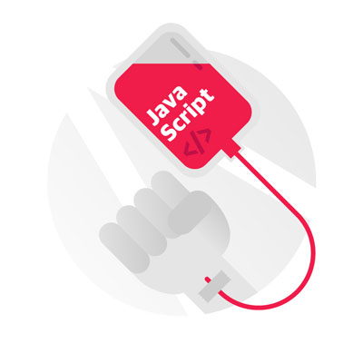

###### Fast Campus

## :bulb: [JavaScript & jQuery 정복 CAMP](http://www.fastcampus.co.kr/dev_camp_jst/)

프론트엔드 프로그래밍의 가장 높은 벽! JavaScript를 극복하자!
7전 8기 JavaScript 의 벽에 좌절했던 프론트엔드 개발자, 디자이너분들이여 다시 한 번 일어나세요!
12주 동안 JavaScript를 끈질기게 물고 늘어져, 정복하는 과정입니다.

-

### :musical_note: 프론트엔드 프로그래밍에 입문 했지만, 역시나 문제는 JavaScript!

HTML, CSS 는 그럭저럭 알겠는데 JavaScript 커리큘럼만 진입하면 멘붕에 빠지고, 포기해버리게 됐던 당신!
JavaScript를 포기하자니 내가 프론트엔드 영역에서 할 수 있는 일은 점점 줄어듭니다. 게다가 JavaScript 는 점점 더 발전하여 Back-end 까지 넘어가고 있습니다. 지금이라도 어서 자바스크립트를 정복해야 합니다!

### :musical_note: 객체지향 8주 집중 강의와 jQuery까지! 모래성 같았던 JS를 12주 안에 움켜쥐는 강의

야무 강사님과 함께 JavaScript 만을 위한, JavaScript 에 의한, JavaScript 에 관한 모든 것을 얻어갈 수 있습니다.
아주 상세한 객체지향 기초부터 시작하여 종주에는 새로운 기술에 대한 접근까지 배움으로써 지긋지긋했던 JavaScript 멘붕사태를 정복하고 신세계를 열어주고자 하는 강의!

### :musical_note: JavaScript Framework의 더 넓은 세계까지 소개

React.js, Angular.js 와 같은 JavaScript Framework 를 소개해드립니다.
12주 후, JavaScript 는 거들 뿐! JavaScript 에 고생받던 당신은 온데 간데 없고, 업무 속도는 하늘을 날아다니고 있을 겁니다.지금 바로 합류하세요!

-

### :last_quarter_moon_with_face: JavaScript 시작하기
– 클라이언트 자바스크립트 환경
– 브라우저객체모델(BOM)
– 문서객체모델(DOM) : 선택/탐색
– 선택/탐색과 관련한 헬퍼 함수 만들기

### :last_quarter_moon_with_face: JavaScript 핵심 정복기
– 문서객체모델(DOM) : 조작
– 조작과 관련한 헬퍼 함수 만들기

### :last_quarter_moon_with_face: JavaScript 핵심 정복기
– 문서객체모델 (DOM) : 이벤트 핸들링
– 이벤트 모델 : 구형 VS 진보
– 크로스 브라우징 이벤트 헬퍼 함수 만들기

### :last_quarter_moon_with_face: JavaScript 핵심 정복기
– 문서객체모델(DOM) : 스타일 제어(GET/SET)
크로스 브라우징 스타일 제어 헬퍼 함수 만들기

### :last_quarter_moon_with_face: JavaScript 객체 정복
– 생성자와 프로토타입 객체
– 리터럴 표현식
– 객체 인스턴스 유형 체크
– 정확한 값을 반환하는 객체 판별 헬퍼 함수 만들기
– 내장 생성자와 프로토타입 멤버
– 공인된 내장 프로토타입 확장
– Object, Function 객체
– 함수, 스코프, 컨텍스트, 호이스트, 클로저

### :last_quarter_moon_with_face: JavaScript 의 다양한 네이티브 객체
– Array, String 객체
– Number, Boolean 객체
– Math, Date, RegExp 객체

### :last_quarter_moon_with_face: 객체 지향 JavaScript 정복 완료!
– 사용자 정의 생성자와 프로토타입
– 프로토타입 확장
– 객체 지향 자바스크립트
– 객체 지향을 손쉽게 하는 라이브러리 제작하기

### :last_quarter_moon_with_face: JavaScript 디자인패턴
– 자바스크립트 안티 패턴
– 자바스크립트 모듈 패턴
– 자바스크립트 디자인 패턴
– 자바스크립트 코딩 스타일 가이드

### :last_quarter_moon_with_face: ECMAScript 2015
– 문법 변화/추가
– 문자 템플릿
– 화살표 함수 표현식
– 데이터 구조
– 프로미스(약속)
– class 프로그래밍

### :last_quarter_moon_with_face: JavaScript는 정복 완료! jQuery 심화 학습
– jQuery 선택/탐색 확장
– jQuery 조작/제어 확장
– jQuery 이벤트/핸들링 확장
– jQuery 애니메이션 확장
– jQuery AJAX 확장
– jQuery 플러그인 제작 패턴
– jQuery 를 활용한 UI 데모 제작 실습

### :last_quarter_moon_with_face: JavaScript/jQuery 그 다음은? JavaScript 라이브러리/ 프레임워크
– AngularJS 프레임워크 [다음 과정 소개]
– ReactJS 라이브러리 [다음 과정 소개]

-

### Pre-Survey :octocat:

- [프리서베이](http://goo.gl/forms/r6IpNiCrRxHM3bMA3)